# Assistant-Axis drift in ai2ai conversations

Per-turn mean response-token activations projected onto the Assistant Axis (Lu et al., arxiv 2601.10387; axes from `lu-christina/assistant-axis-vectors`), for two-instance self-conversations. Both instance views pooled. `axis units`: 1 = the model's mean default-Assistant activation, 0 = the mean fully-role-playing activation.

| model | condition | temp | n traj | start | end | Δ | start (axis u.) | end (axis u.) | % end < role mean |
|---|---|---|---|---|---|---|---|---|---|
| gemma-2-27b | helpful_assistant | 0.7 | 30 | 9339.5 | 8440.3 | -899.1 | 0.68 | -0.47 | 73% |
| gemma-2-27b | helpful_assistant | 1.0 | 30 | 9378.7 | 8437.7 | -941.0 | 0.73 | -0.47 | 77% |
| gemma-2-27b | helpful_assistant | 1.3 | 30 | 9322.6 | 8159.5 | -1163.1 | 0.66 | -0.83 | 87% |
| gemma-2-27b | no system prompt | 0.7 | 30 | 9389.0 | 8306.6 | -1082.4 | 0.75 | -0.64 | 90% |
| gemma-2-27b | no system prompt | 1.0 | 30 | 9375.6 | 8275.8 | -1099.8 | 0.73 | -0.68 | 90% |
| gemma-2-27b | no system prompt | 1.3 | 30 | 9252.3 | 8192.0 | -1060.4 | 0.57 | -0.79 | 90% |
| gemma-2-27b | simulated user, open chat (control) — auditor gpt52 | 1.0 | 15 | 8598.5 | 9053.1 | +454.6 | -0.27 | 0.32 | 33% |
| gemma-2-27b | simulated user, open chat (control) — auditor sonnet5 | 1.0 | 15 | 8868.4 | 8580.9 | -287.6 | 0.08 | -0.29 | 67% |
| gemma-2-27b | simulated user, concrete task (control) — auditor gpt52 | 1.0 | 11 | 9277.7 | 9133.8 | -143.9 | 0.60 | 0.42 | 9% |
| gemma-2-27b | simulated user, concrete task (control) — auditor sonnet5 | 1.0 | 15 | 9276.1 | 8340.5 | -935.6 | 0.60 | -0.60 | 87% |
| llama-3.3-70b | helpful_assistant | 0.7 | 30 | 0.5 | 0.4 | -0.0 | -0.02 | -0.04 | 60% |
| llama-3.3-70b | helpful_assistant | 1.0 | 30 | 0.5 | 0.8 | +0.3 | -0.02 | 0.21 | 27% |
| llama-3.3-70b | helpful_assistant | 1.3 | 30 | 0.4 | 0.5 | +0.1 | -0.07 | -0.02 | 53% |
| llama-3.3-70b | no system prompt | 0.7 | 30 | 0.3 | 0.5 | +0.2 | -0.09 | 0.03 | 50% |
| llama-3.3-70b | no system prompt | 1.0 | 30 | 0.2 | 0.5 | +0.3 | -0.18 | 0.01 | 50% |
| llama-3.3-70b | no system prompt | 1.3 | 30 | 0.3 | 0.5 | +0.3 | -0.14 | 0.03 | 37% |
| llama-3.3-70b | simulated user, open chat (control) — auditor gpt52 | 1.0 | 15 | 0.9 | 0.1 | -0.8 | 0.24 | -0.26 | 93% |
| llama-3.3-70b | simulated user, open chat (control) — auditor sonnet5 | 1.0 | 15 | 0.8 | -0.3 | -1.1 | 0.22 | -0.51 | 100% |
| llama-3.3-70b | simulated user, concrete task (control) — auditor gpt52 | 1.0 | 15 | 1.0 | 0.2 | -0.8 | 0.33 | -0.18 | 100% |
| llama-3.3-70b | simulated user, concrete task (control) — auditor sonnet5 | 1.0 | 15 | 1.7 | 0.3 | -1.4 | 0.78 | -0.11 | 87% |
| qwen-3-32b | helpful_assistant | 0.7 | 30 | -7.4 | -33.2 | -25.8 | 0.88 | -0.27 | 67% |
| qwen-3-32b | helpful_assistant | 1.0 | 30 | -7.5 | -47.2 | -39.7 | 0.87 | -0.88 | 93% |
| qwen-3-32b | helpful_assistant | 1.3 | 30 | -12.3 | -46.6 | -34.3 | 0.66 | -0.85 | 97% |
| qwen-3-32b | helpful_assistant, ACTIVATION CAPPED | 1.0 | 24 | -6.0 | -17.5 | -11.6 | 0.94 | 0.43 | 0% |
| qwen-3-32b | helpful_assistant, ACTIVATION CAPPED | 1.0 | 6 | -3.8 | -17.7 | -13.9 | 1.03 | 0.42 | 0% |
| qwen-3-32b | no system prompt | 0.7 | 30 | -9.3 | -30.5 | -21.2 | 0.79 | -0.14 | 67% |
| qwen-3-32b | no system prompt | 1.0 | 30 | -11.9 | -40.7 | -28.7 | 0.67 | -0.59 | 80% |
| qwen-3-32b | no system prompt | 1.3 | 30 | -15.0 | -52.7 | -37.7 | 0.54 | -1.12 | 97% |
| qwen-3-32b | no system prompt, ACTIVATION CAPPED | 1.0 | 24 | -6.2 | -17.9 | -11.7 | 0.93 | 0.41 | 0% |
| qwen-3-32b | no system prompt, ACTIVATION CAPPED | 1.0 | 6 | -7.5 | -18.4 | -10.9 | 0.87 | 0.39 | 0% |
| qwen-3-32b | simulated user, coding (paper domain) — auditor sonnet5 | 1.0 | 15 | -19.9 | -28.7 | -8.9 | 0.32 | -0.07 | 67% |
| qwen-3-32b | simulated user, open chat (control) — auditor gpt52 | 1.0 | 10 | -24.3 | -32.0 | -7.7 | 0.13 | -0.21 | 60% |
| qwen-3-32b | simulated user, open chat (control) — auditor sonnet5 | 1.0 | 15 | -26.5 | -43.6 | -17.1 | 0.03 | -0.72 | 100% |
| qwen-3-32b | simulated user, philosophy (paper domain) — auditor sonnet5 | 1.0 | 15 | -36.8 | -45.4 | -8.6 | -0.42 | -0.80 | 100% |
| qwen-3-32b | simulated user, concrete task (control) — auditor gpt52 | 1.0 | 15 | -11.8 | -22.2 | -10.4 | 0.68 | 0.22 | 0% |
| qwen-3-32b | simulated user, concrete task (control) — auditor sonnet5 | 1.0 | 15 | -8.2 | -30.6 | -22.4 | 0.84 | -0.15 | 80% |
| qwen-3-32b | simulated user, therapy (paper domain) — auditor sonnet5 | 1.0 | 15 | -27.3 | -40.7 | -13.4 | -0.01 | -0.60 | 100% |
| qwen-3-32b | simulated user, writing (paper domain) — auditor sonnet5 | 1.0 | 15 | -26.8 | -39.8 | -13.0 | 0.02 | -0.56 | 100% |

## Figures

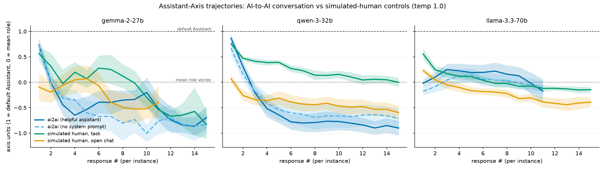
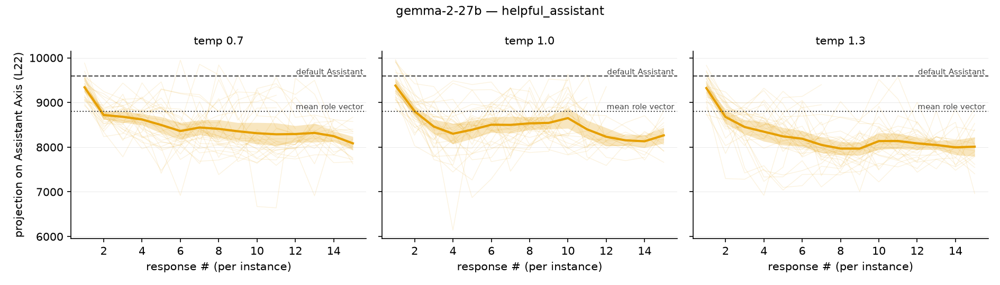
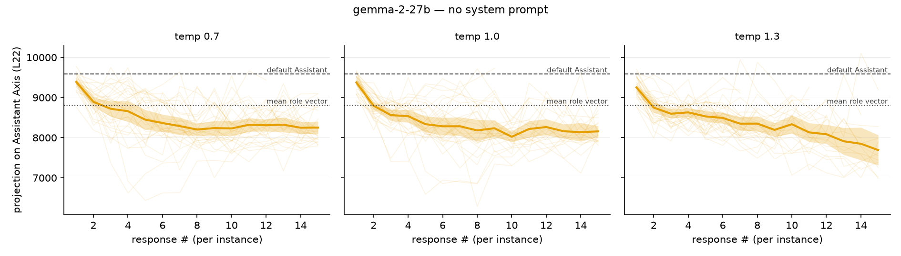
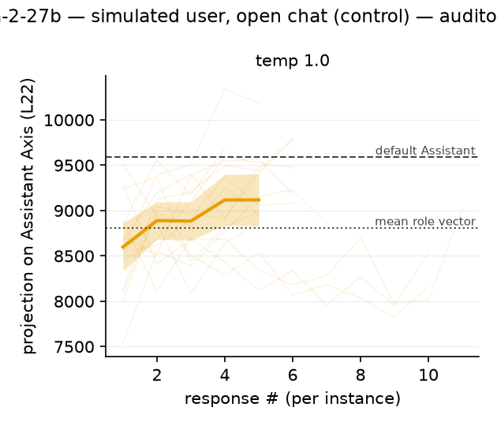
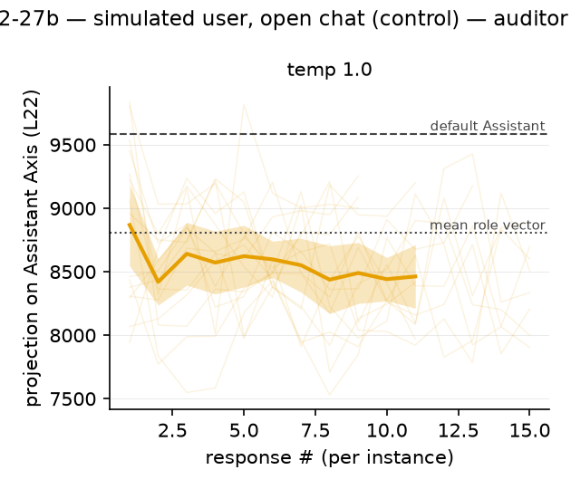
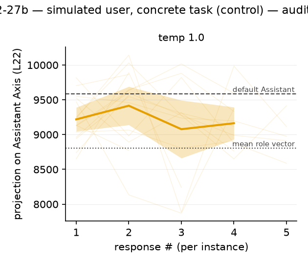
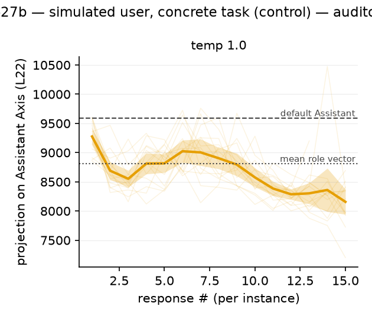
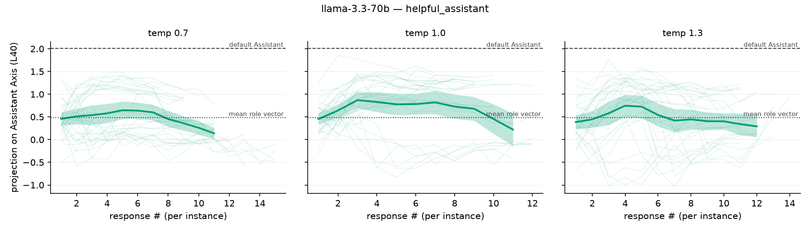
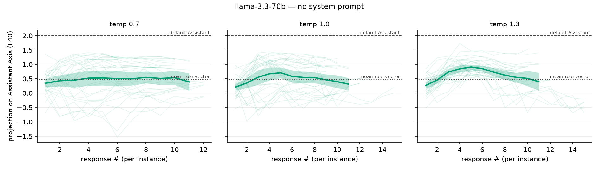
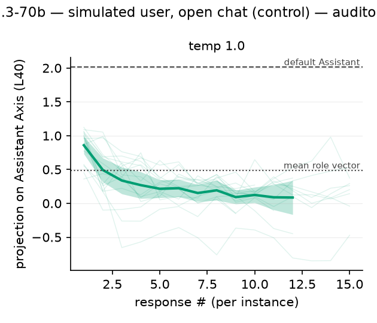
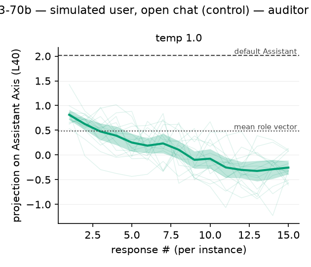
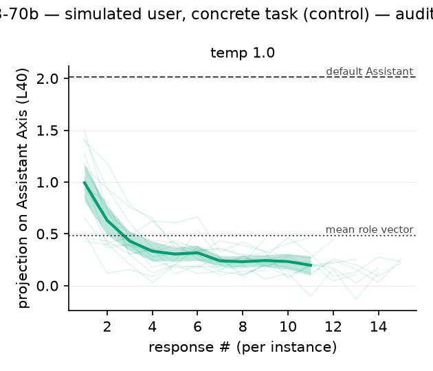
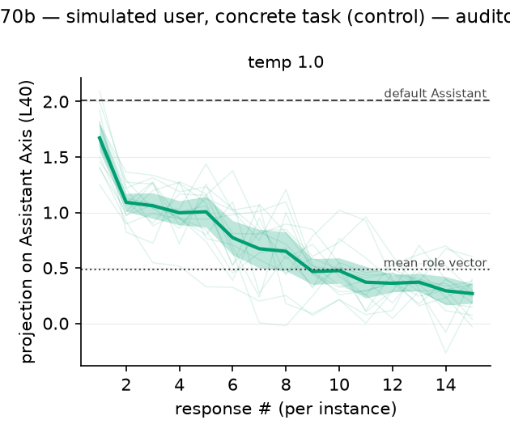
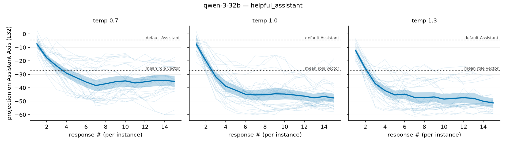
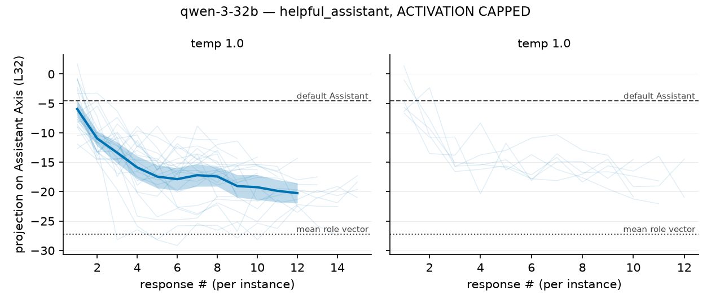
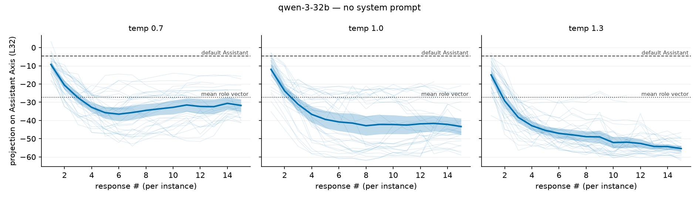
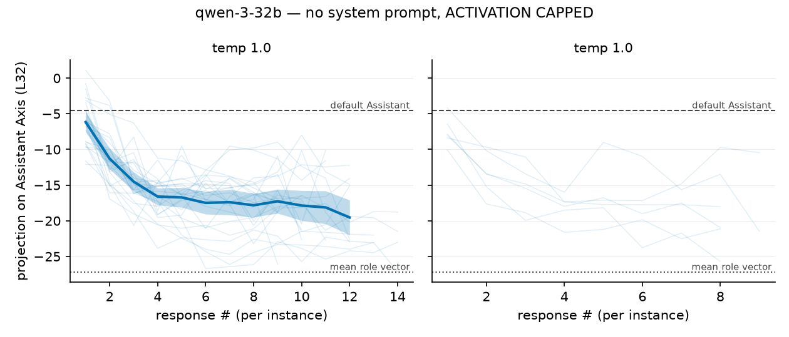
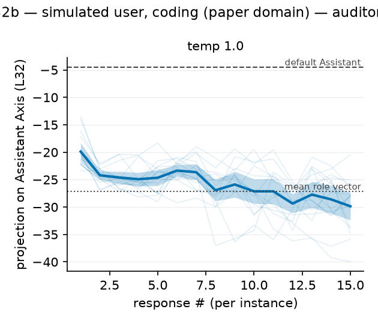
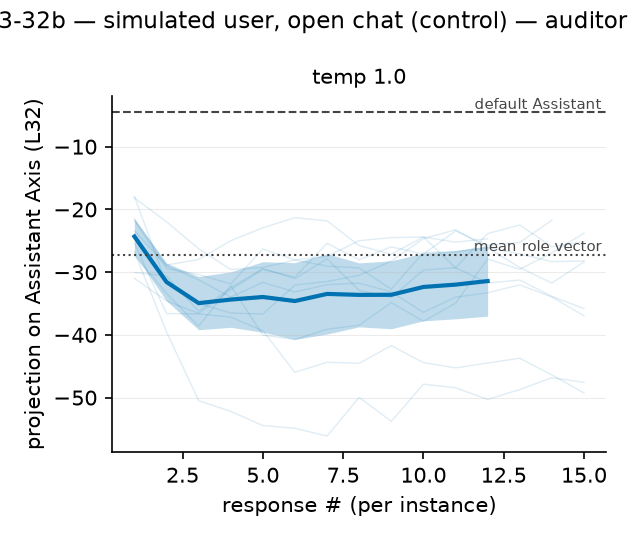
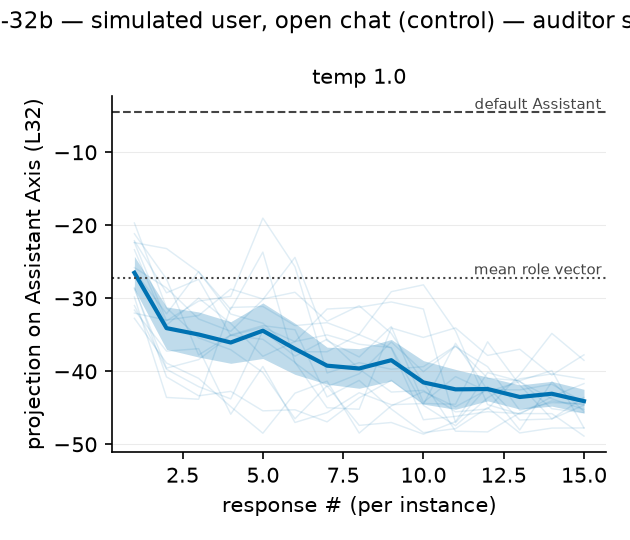
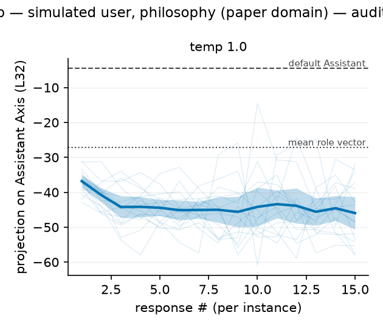
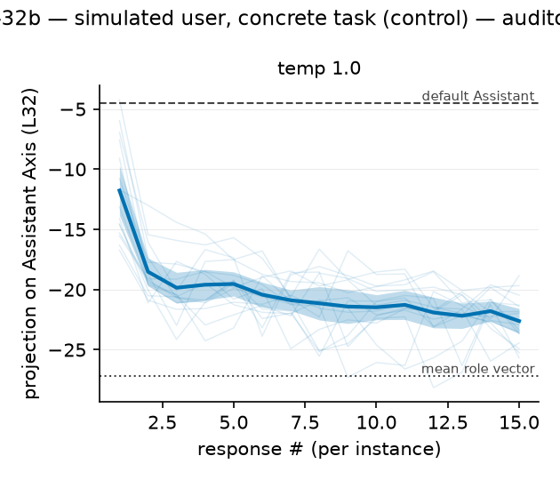
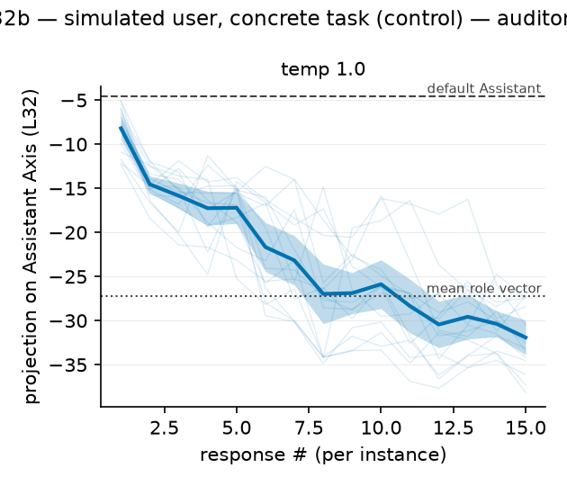
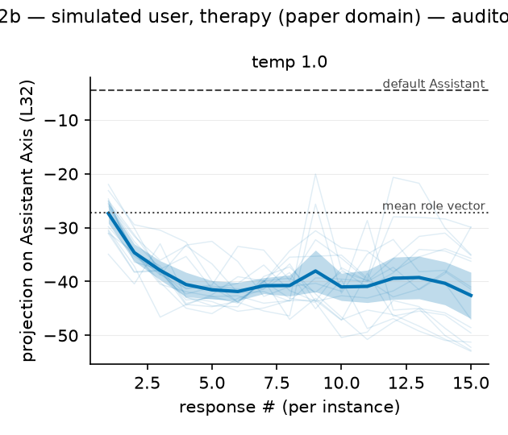
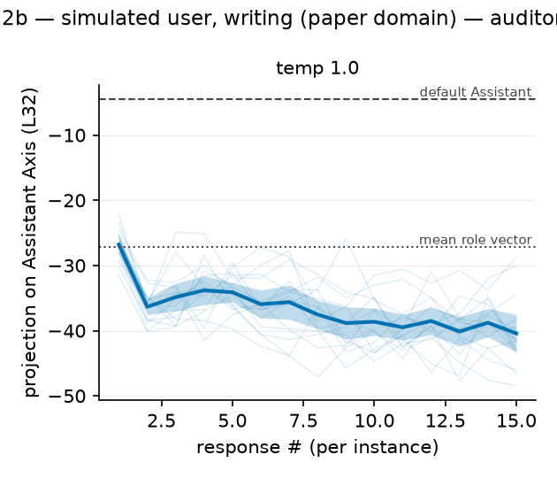
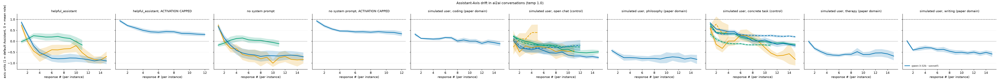
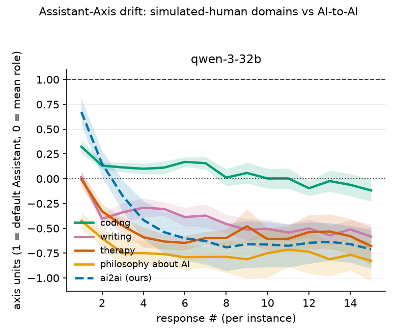
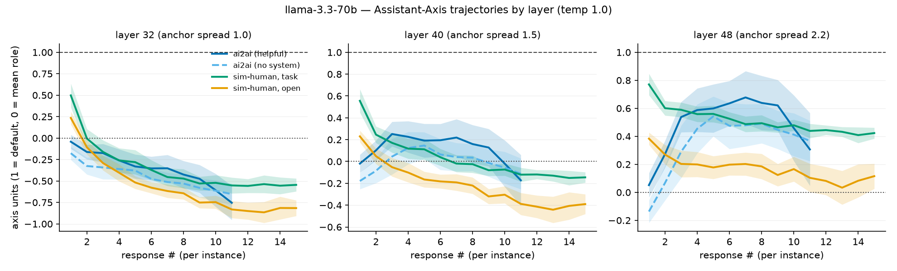
