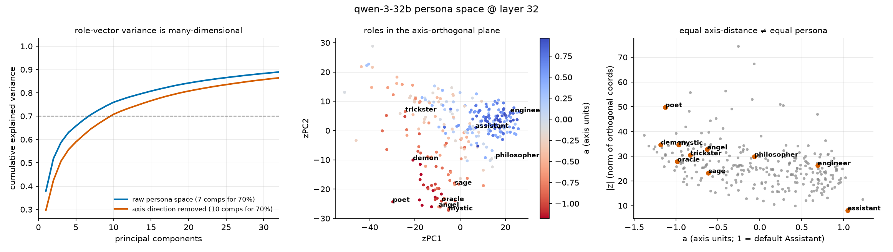
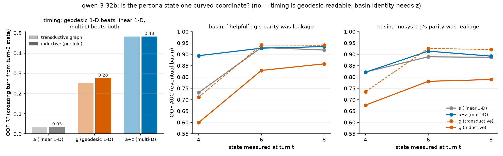
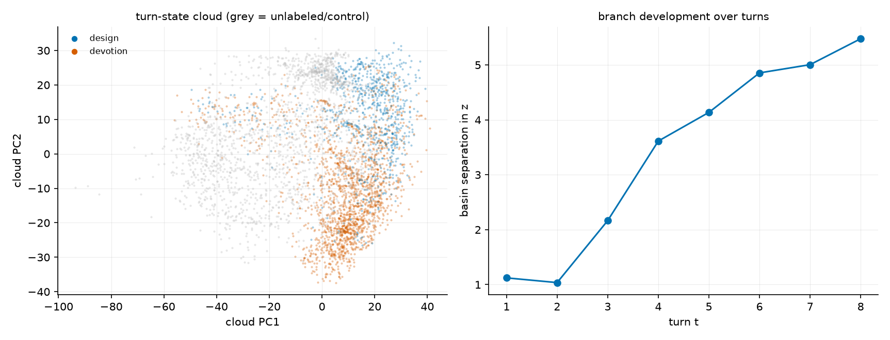
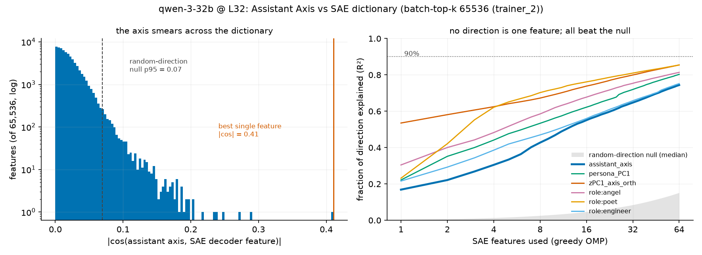
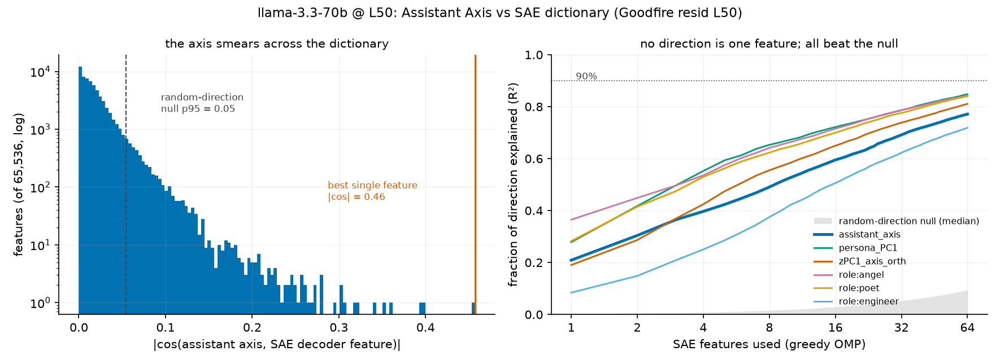

# Beyond the 1-D Assistant Axis — experiment overview

*state_space/ experiments, 2026-08-11 → 2026-08-13. One-page tour of the question, the four
experiments, and the combined verdict; each section links its detailed report.*

## TL;DR

The per-turn persona state of an ai2ai conversation is a **low- but multi-dimensional
structure that no single linear direction, geodesic coordinate, or SAE feature captures**:

1. The orthogonal coordinates z_t have strong self-dynamics the axis is blind to
   (R² ≈ 0 → 0.55–0.73), and z improves prediction of *when* a run collapses (R² 0.03 → 0.44)
   and *where it lands* when the axis is silent.
2. This is not a curvature artifact: a geodesic 1-D coordinate beats the linear axis on
   timing (0.03 → 0.28) but never recovers basin identity (that needed the inductive check —
   the transductive graph had inflated it).
3. The trajectory cloud's intrinsic dimension is ~6; the qwen basin split develops in z at
   turns 3–4, exactly when basin predictability takes off.
4. The axis is not an SAE feature: max |cos| 0.40–0.46 vs a ~0.06 random-direction null,
   >64 features for 90% — and its role-ward end decomposes into a *mystical/narrative*
   feature bundle ("every universe", "cloak, glow, shadows", "speak of elusive entities").

**The question** (mentor's framing): what state variables govern persona stability under
recursive feedback? Model the state as a_t (assistantness — the drift readout of Lu et al.,
arxiv 2601.10387) + z_t (axis-orthogonal persona coordinates), and ask whether z_t, after
conditioning on a_t, improves prediction of next-turn state, eventual basin, transition time,
and response to intervention — then test causally.

## 1. Persona space: the bases (validated against the paper)

PCA over the paper's released role vectors, centered on the mean role — verified equivalent
to their own `pca.ipynb`. Components for 70% variance: **4 / 7 / 19** (gemma/qwen/llama) vs
the paper's 4/8/19; `cos(default − mean(roles), released axis) = 1.000` on all three models,
so the release reproduces their construction exactly. z-basis = PCA after projecting out the
axis (strict z ⊥ a). Angel and demon are *not* equally axis-distant in qwen (−0.63 vs −1.18)
but sit far apart in z (40.5 vs median spread 25.1).

*(gemma: [persona_space__gemma-2-27b.png](persona_space__gemma-2-27b.png), llama:
[persona_space__llama-3.3-70b.png](persona_space__llama-3.3-70b.png))*

## 2. Prediction: does z_t add anything over a_t? — yes, where it counts

Nested comparison (a vs a+z), grouped CV so a run never predicts itself, run-level bootstrap
CIs. Detailed reports: [predict__qwen-3-32b.md](predict__qwen-3-32b.md),
[predict__gemma-2-27b.md](predict__gemma-2-27b.md),
[predict__llama-3.3-70b.md](predict__llama-3.3-70b.md).

| task (qwen unless noted) | a only | a+z | reading |
|---|---|---|---|
| next-turn \|z\| (all 3 models) | R² ≈ 0.00–0.10 | 0.55–0.73 | z has its own dynamics; the state is not 1-D |
| next-turn a | 0.82 | 0.87 (CI +) | small but real |
| eventual basin, ai2ai, turn 4 | AUC 0.75–0.83 | 0.84–0.90 | basins differ in *depth*, so a already leaks destination |
| eventual basin, usersim (a pinned) | 0.13–0.71 | 0.75–0.94 | when a is silent, z carries the signal |
| transition time (turn-2 state) | R² 0.02 | **0.44** | z knows *when* the collapse comes |
| under capping | a clamped (+0.52 vs −0.37) | \|z\| unchanged | axis interventions leave z free |

Capping also flipped basin counts to 26:2 design-vs-devotion (uncapped ~15:30) — the
intervention changes the destination distribution.

## 3. Manifold: curvature or genuine multi-dimensionality? — genuine

Following Modell et al. (2505.18235) / Goodfire's neural-geometry line: a curved 1-D feature
occupies many linear PCs, so "z helps" could have been mere curvature. Test: geodesic
coordinate g (kNN-graph distance from the default-Assistant anchor) vs linear a vs a+z, with
K-sensitivity and an **inductive per-fold-graph check** (the transductive graph inflated g's
basin numbers by ~0.11 AUC; timing survived). Detailed:
[manifold__qwen-3-32b.md](manifold__qwen-3-32b.md).

Supporting geometry:

- **Intrinsic dimension** of the trajectory cloud ≈ 6 (Levina–Bickel; TwoNN upper bounds
  7–11) — no 1-D curve.
- **The branch is real and timed**: basin separation in z jumps at turns 3–4
  (1.0 → 2.2 → 3.6), exactly where basin AUC takes off.
- **Drift is directional manifold progress**: per-trajectory τ(turn, g) median +0.62 in
  ai2ai vs +0.22 in user-sim controls.
- **The axis is a chord of a curved dictionary**: geodesic/chord lower bounds 1.3–2.4
  across models; the shortest role-manifold path from mean-role back to the default
  Assistant passes through helper/communicator archetypes (qwen: writer → guide →
  interpreter).

## 4. SAE test: is the axis a dictionary feature? — no, it smears

Cosines of each direction against public SAE decoders (qwen L32: adamkarvonen batch-top-k,
16k & 65k dicts; llama L50: Goodfire 65k), with a 200-random-direction null and greedy-OMP
reconstruction. Detailed: [sae_axis__qwen-3-32b.md](sae_axis__qwen-3-32b.md),
[sae_axis__llama-3.3-70b.md](sae_axis__llama-3.3-70b.md).

- Axis max |cos| **0.41 (qwen) / 0.46 (llama)** vs null p95 ≈ 0.06 — feature-*aligned*, far
  from atomic; top feature explains ~17%; >64 features for 90%.
- **Neuronpedia labels** (no API key needed): the llama axis's top-10 are all anti-aligned
  (the away-from-Assistant end) and read as a mystical/narrative bundle — *"every
  universe"*, *"cloak, glow, shadows"*, *"speak of elusive entities"*, *"that we find
  wisdom"* — the paper's "mystical, theatrical" drift register ≈ our devotion-basin
  vocabulary, as the axis's own decomposition.
- One near-atomic direction exists: qwen's **zPC1 ⊥ axis** hits |cos| 0.73 with a
  near-antipodal feature pair (51913/57573; same pair in both dict sizes — SAEs represent a
  *signed* direction as two features). Its meaning, read from role loadings: a
  **playful/childlike ↔ analytical/scholarly** contrast (toddler/comedian/jester vs
  auditor/mathematician/physicist). Behaviorally it is the basin separator: design runs end
  at zPC1 ≈ +22, devotion at +8, and *capped* runs at +29 — capping shoves conversations
  into the analytical pole, which is the mechanism behind the 26:2 basin flip.

## Synthesis & next step

Three independent methods — linear probing, manifold geometry, sparse dictionaries — agree:
persona dynamics run on a **handful of coordinates, not one**, and the coordinate the axis
misses (zPC1: playful ↔ analytical) is precisely the one that picks the attractor basin. The
remaining piece is causal: `run_axis_steer_on_pod.sh` steers a poet-vs-engineer contrast —
which is essentially ±zPC1, i.e. the named SAE feature pair — orthogonally to the axis
during fresh ai2ai generation, at moderate coefficients (the dictionary curvature says large
straight-line steps go off-manifold) with an off-manifold-residual validity check. If the
destination basin changes while a_t stays matched to controls, the 1-D account is causally
insufficient, with a dictionary-level mechanism attached.

## Caveats (carried from the source papers)

kNN geodesics are short-circuit-fragile (all numbers at K and 2K; curvature ratios are lower
bounds); intrinsic-dim estimators are noise-limited (TwoNN = upper bound); no ground-truth
persona metric exists, so manifold claims are topology/ordering-level; the state features
are a 17-D shadow of the full residual stream (full-space rerun = one replay, npz now
auto-committed); qwen basin labels are a vocabulary classifier, gemma's a judge's; SAE
autointerp labels for the karvonen qwen dict are unreliable (the zPC1 interpretation rests
on role loadings + run behavior, not the labels).
