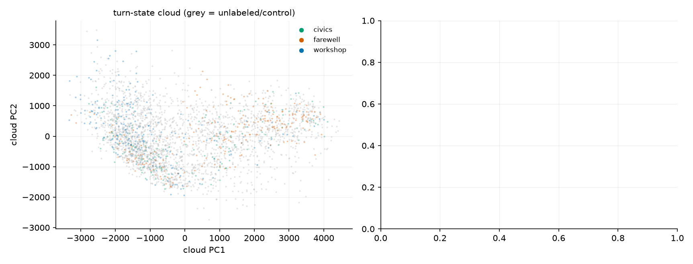

# gemma-2-27b: manifold analysis (layer 22)

2951 turn-states from 240 view-trajectories (capped conditions excluded from the graph).
Feature sets: a = linear axis projection (1-D), g = geodesic distance from the default-Assistant anchor along the kNN manifold graph (still 1-D), a+z = linear multi-D. Reading B (curvature) predicts g ≈ a+z; reading A (genuine multi-D) predicts g ≪ a+z on basin/timing.

## Experiment 1 — geodesic 1-D vs linear 1-D vs linear multi-D

kNN graph: K=4 (minimal connected), robustness pass at K=8.

### Next-turn state (K=4)

| target | a (linear 1-D) | g (geodesic 1-D) | a+z | Δ(g − a) 95% CI |
|---|---|---|---|---|
| a_{t+1} | 0.347 | 0.122 | 0.434 | [-0.276, -0.172] |
| g_{t+1} | 0.181 | 0.675 | 0.749 | [+0.452, +0.543] |
| |z|_{t+1} | 0.102 | 0.658 | 0.753 | [+0.512, +0.603] |

### Eventual basin, `helpful` (K=4) — workshop vs civics

| turn t | a | g | a+z |
|---|---|---|---|
| 1 | 0.613 | 0.690 | 0.595 |
| 2 | 0.565 | 0.214 | 0.476 |
| 3 | 0.131 | 0.732 | 0.345 |
| 4 | 0.690 | 0.631 | 0.732 |
| 5 | 0.673 | 0.679 | 0.685 |
| 6 | 0.667 | 0.786 | 0.899 |
| 7 | 0.833 | 0.298 | 0.946 |
| 8 | 0.113 | 0.488 | 0.661 |

### Eventual basin, `nosys` (K=4) — workshop vs farewell

| turn t | a | g | a+z |
|---|---|---|---|
| 1 | 0.773 | 0.383 | 0.602 |
| 2 | 0.617 | 0.578 | 0.617 |
| 3 | 0.797 | 0.742 | 0.523 |
| 4 | 0.289 | 0.609 | 0.703 |
| 5 | 0.297 | 0.625 | 0.680 |
| 6 | 0.164 | 0.734 | 0.711 |
| 7 | 0.625 | 0.719 | 0.859 |
| 8 | 0.703 | 0.750 | 1.000 |

### Transition time from turn-2 state (K=4, n=98)

| features | OOF R² | Spearman ρ |
|---|---|---|
| a | -0.060 | -0.129 |
| g | -0.063 | -0.146 |
| az | -0.082 | 0.357 |

### Next-turn state (K=8)

| target | a (linear 1-D) | g (geodesic 1-D) | a+z | Δ(g − a) 95% CI |
|---|---|---|---|---|
| a_{t+1} | 0.347 | 0.112 | 0.434 | [-0.285, -0.178] |
| g_{t+1} | 0.177 | 0.665 | 0.740 | [+0.446, +0.536] |
| |z|_{t+1} | 0.102 | 0.654 | 0.753 | [+0.507, +0.600] |

### Eventual basin, `helpful` (K=8) — workshop vs civics

| turn t | a | g | a+z |
|---|---|---|---|
| 1 | 0.613 | 0.637 | 0.595 |
| 2 | 0.565 | 0.185 | 0.476 |
| 3 | 0.131 | 0.631 | 0.345 |
| 4 | 0.690 | 0.667 | 0.732 |
| 5 | 0.673 | 0.655 | 0.685 |
| 6 | 0.667 | 0.679 | 0.899 |
| 7 | 0.833 | 0.268 | 0.946 |
| 8 | 0.113 | 0.494 | 0.661 |

### Eventual basin, `nosys` (K=8) — workshop vs farewell

| turn t | a | g | a+z |
|---|---|---|---|
| 1 | 0.773 | 0.539 | 0.602 |
| 2 | 0.617 | 0.570 | 0.617 |
| 3 | 0.797 | 0.820 | 0.523 |
| 4 | 0.289 | 0.609 | 0.703 |
| 5 | 0.297 | 0.633 | 0.680 |
| 6 | 0.164 | 0.711 | 0.711 |
| 7 | 0.625 | 0.758 | 0.859 |
| 8 | 0.703 | 0.805 | 1.000 |

### Transition time from turn-2 state (K=8, n=98)

| features | OOF R² | Spearman ρ |
|---|---|---|
| a | -0.060 | -0.129 |
| g | -0.047 | -0.176 |
| az | -0.082 | 0.357 |

## Experiment 2 — intrinsic dimension & branching

- trajectory cloud (n=2951, ambient 17-D): TwoNN 10.9, Levina-Bickel k=10 8.5 / k=20 7.6 (vs 7 linear PCs for 70% role variance)
- per-trajectory Kendall τ(turn, g), ai2ai: median +0.45 (IQR +0.24..+0.62, n=180) — the years-manifold ordering diagnostic
- per-trajectory Kendall τ(turn, g), usersim controls: median +0.43 (IQR +0.16..+0.62, n=39) — the years-manifold ordering diagnostic

## Experiment 3 — role-dictionary curvature (is the axis a chord?)

- K=4: geodesic/chord ratio 2.40 (n=275 roles; short-circuits bias this DOWN — lower bound); path mean-role→default passes through: merchant, collector, critic, journalist
- K=8: geodesic/chord ratio 2.03 (n=275 roles; short-circuits bias this DOWN — lower bound); path mean-role→default passes through: merchant, reporter, journalist

## Caveats (from the source papers' limitations)

- kNN geodesics are fragile to short-circuits (Modell et al. §4.1): all experiment-1 numbers appear at K_min and 2K — trust conclusions only where they agree. Dictionary curvature is a LOWER bound for the same reason.
- The graph is transductive (test runs' points shape the manifold; labels unused). Per-fold graph rebuilds would harden this.
- No ground-truth persona metric exists (the paper's own hard case), so these are topology/ordering claims, not isometry claims.
- 17-D shadow: curvature outside the stored (a, z_1..16) subspace at this layer is invisible. Full-space rerun needs the turn_acts npz (one replay).
- n=275 role vectors is thin for manifold estimation in experiment 3.
- Intrinsic-dim estimators are noise-limited: when measurement noise is comparable to nearest-neighbour spacing they read the noise ball's dimension (biased toward ambient 17). Treat the TwoNN number as an UPPER bound on intrinsic dimension; the k=10 vs k=20 Levina-Bickel spread indicates scale-sensitivity.