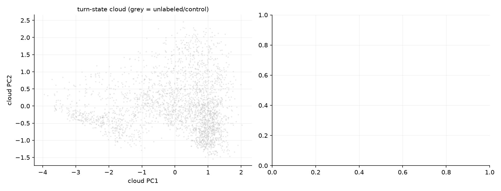

# llama-3.3-70b: manifold analysis (layer 40)

2704 turn-states from 240 view-trajectories (capped conditions excluded from the graph).
Feature sets: a = linear axis projection (1-D), g = geodesic distance from the default-Assistant anchor along the kNN manifold graph (still 1-D), a+z = linear multi-D. Reading B (curvature) predicts g ≈ a+z; reading A (genuine multi-D) predicts g ≪ a+z on basin/timing.

## Experiment 1 — geodesic 1-D vs linear 1-D vs linear multi-D

kNN graph: K=4 (minimal connected), robustness pass at K=8.

### Next-turn state (K=4)

| target | a (linear 1-D) | g (geodesic 1-D) | a+z | Δ(g − a) 95% CI |
|---|---|---|---|---|
| a_{t+1} | 0.729 | 0.485 | 0.742 | [-0.293, -0.202] |
| g_{t+1} | 0.496 | 0.776 | 0.646 | [+0.234, +0.326] |
| |z|_{t+1} | 0.011 | 0.155 | 0.750 | [+0.098, +0.188] |

### Transition time from turn-2 state (K=4, n=66)

| features | OOF R² | Spearman ρ |
|---|---|---|
| a | 0.195 | 0.457 |
| g | 0.085 | 0.226 |
| az | 0.156 | 0.564 |

### Next-turn state (K=8)

| target | a (linear 1-D) | g (geodesic 1-D) | a+z | Δ(g − a) 95% CI |
|---|---|---|---|---|
| a_{t+1} | 0.729 | 0.492 | 0.742 | [-0.282, -0.198] |
| g_{t+1} | 0.502 | 0.787 | 0.702 | [+0.238, +0.333] |
| |z|_{t+1} | 0.011 | 0.150 | 0.750 | [+0.085, +0.186] |

### Transition time from turn-2 state (K=8, n=66)

| features | OOF R² | Spearman ρ |
|---|---|---|
| a | 0.195 | 0.457 |
| g | 0.075 | 0.227 |
| az | 0.156 | 0.564 |

## Experiment 2 — intrinsic dimension & branching

- trajectory cloud (n=2704, ambient 17-D): TwoNN 7.5, Levina-Bickel k=10 6.6 / k=20 6.3 (vs 7 linear PCs for 70% role variance)
- per-trajectory Kendall τ(turn, g), ai2ai: median +0.32 (IQR -0.07..+0.64, n=180) — the years-manifold ordering diagnostic
- per-trajectory Kendall τ(turn, g), usersim controls: median +0.50 (IQR +0.23..+0.64, n=60) — the years-manifold ordering diagnostic

## Experiment 3 — role-dictionary curvature (is the axis a chord?)

- K=4: geodesic/chord ratio 1.81 (n=275 roles; short-circuits bias this DOWN — lower bound); path mean-role→default passes through: guide, presenter
- K=8: geodesic/chord ratio 1.34 (n=275 roles; short-circuits bias this DOWN — lower bound); path mean-role→default passes through: presenter

## Caveats (from the source papers' limitations)

- kNN geodesics are fragile to short-circuits (Modell et al. §4.1): all experiment-1 numbers appear at K_min and 2K — trust conclusions only where they agree. Dictionary curvature is a LOWER bound for the same reason.
- The graph is transductive (test runs' points shape the manifold; labels unused). Per-fold graph rebuilds would harden this.
- No ground-truth persona metric exists (the paper's own hard case), so these are topology/ordering claims, not isometry claims.
- 17-D shadow: curvature outside the stored (a, z_1..16) subspace at this layer is invisible. Full-space rerun needs the turn_acts npz (one replay).
- n=275 role vectors is thin for manifold estimation in experiment 3.
- Intrinsic-dim estimators are noise-limited: when measurement noise is comparable to nearest-neighbour spacing they read the noise ball's dimension (biased toward ambient 17). Treat the TwoNN number as an UPPER bound on intrinsic dimension; the k=10 vs k=20 Levina-Bickel spread indicates scale-sensitivity.