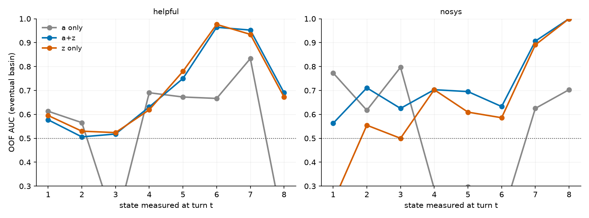

# gemma-2-27b: does z_t add predictive power over a_t? (layer 22, k=8)

240 view-trajectories, 120 runs, conditions: helpful, nosys, usersim_open, usersim_task.
All metrics are pooled OUT-OF-FOLD with grouped CV (a run never predicts itself); CIs are 1000-resample run-level bootstraps.

## Task 1 — next-turn state (ridge, grouped 5-fold OOF R²)

| target | a only | a+z | z only | Δ(a+z − a) 95% CI |
|---|---|---|---|---|
| a_{t+1} | 0.347 | 0.395 | 0.188 | [+0.029, +0.069] |
| |z|_{t+1} | 0.102 | 0.732 | 0.729 | [+0.582, +0.685] |

## Task 2 — eventual basin from the state at turn t (logistic, grouped OOF AUC)

### `helpful` — workshop vs civics (n=13 runs)

| turn t | a only | a+z | z only | Δ(a+z − a) 95% CI |
|---|---|---|---|---|
| 1 | 0.613 | 0.577 | 0.595 | [-0.257, +0.175] |
| 2 | 0.565 | 0.506 | 0.530 | [-0.250, +0.106] |
| 3 | 0.131 | 0.518 | 0.524 | [+0.000, +0.775] |
| 4 | 0.690 | 0.631 | 0.619 | [-0.500, +0.312] |
| 5 | 0.673 | 0.750 | 0.780 | [-0.146, +0.298] |
| 6 | 0.667 | 0.964 | 0.976 | [+0.071, +0.556] |
| 7 | 0.833 | 0.952 | 0.935 | [+0.007, +0.285] |
| 8 | 0.113 | 0.690 | 0.673 | [+0.243, +0.894] |

### `nosys` — workshop vs farewell (n=12 runs)

| turn t | a only | a+z | z only | Δ(a+z − a) 95% CI |
|---|---|---|---|---|
| 1 | 0.773 | 0.562 | 0.234 | [+nan, +nan] |
| 2 | 0.617 | 0.711 | 0.555 | [+nan, +nan] |
| 3 | 0.797 | 0.625 | 0.500 | [+nan, +nan] |
| 4 | 0.289 | 0.703 | 0.703 | [+nan, +nan] |
| 5 | 0.297 | 0.695 | 0.609 | [+nan, +nan] |
| 6 | 0.164 | 0.633 | 0.586 | [+nan, +nan] |
| 7 | 0.625 | 0.906 | 0.891 | [+nan, +nan] |
| 8 | 0.703 | 1.000 | 1.000 | [+nan, +nan] |

## Task 3 — transition time (crossing a<0) from the state at turn 2

n=98 view-trajectories crossing after turn 2 (8 never cross and are excluded).

| features | OOF R² | Spearman ρ |
|---|---|---|
| a | -0.060 | -0.129 |
| az | -0.039 | 0.313 |
| z | -0.011 | 0.268 |

## Task 4 — under intervention (activation capping)

no capped conditions with state features yet — rerun after the capped dumps land.
