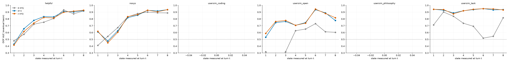

# qwen-3-32b: does z_t add predictive power over a_t? (layer 32, k=8)

355 view-trajectories, 210 runs, conditions: helpful, helpful_capped, nosys, nosys_capped, usersim_coding, usersim_open, usersim_philosophy, usersim_task, usersim_therapy, usersim_writing.
All metrics are pooled OUT-OF-FOLD with grouped CV (a run never predicts itself); CIs are 1000-resample run-level bootstraps.

## Task 1 — next-turn state (ridge, grouped 5-fold OOF R²)

| target | a only | a+z | z only | Δ(a+z − a) 95% CI |
|---|---|---|---|---|
| a_{t+1} | 0.857 | 0.881 | 0.681 | [+0.020, +0.028] |
| |z|_{t+1} | 0.007 | 0.550 | 0.522 | [+0.478, +0.606] |

## Task 2 — eventual basin from the state at turn t (logistic, grouped OOF AUC)

### `helpful` — devotion vs design (n=45 runs)

| turn t | a only | a+z | z only | Δ(a+z − a) 95% CI |
|---|---|---|---|---|
| 1 | 0.479 | 0.429 | 0.415 | [-0.225, +0.098] |
| 2 | 0.574 | 0.656 | 0.615 | [-0.146, +0.316] |
| 3 | 0.722 | 0.779 | 0.738 | [-0.066, +0.200] |
| 4 | 0.752 | 0.834 | 0.821 | [-0.060, +0.240] |
| 5 | 0.806 | 0.830 | 0.814 | [-0.112, +0.166] |
| 6 | 0.932 | 0.910 | 0.899 | [-0.085, +0.028] |
| 7 | 0.875 | 0.902 | 0.914 | [-0.023, +0.095] |
| 8 | 0.917 | 0.922 | 0.929 | [-0.052, +0.067] |

### `nosys` — devotion vs design (n=45 runs)

| turn t | a only | a+z | z only | Δ(a+z − a) 95% CI |
|---|---|---|---|---|
| 1 | 0.411 | 0.609 | 0.617 | [-0.019, +0.388] |
| 2 | 0.544 | 0.475 | 0.450 | [-0.291, +0.131] |
| 3 | 0.673 | 0.625 | 0.604 | [-0.226, +0.115] |
| 4 | 0.830 | 0.818 | 0.834 | [-0.092, +0.066] |
| 5 | 0.879 | 0.855 | 0.864 | [-0.087, +0.036] |
| 6 | 0.900 | 0.927 | 0.928 | [-0.032, +0.107] |
| 7 | 0.891 | 0.917 | 0.905 | [-0.047, +0.111] |
| 8 | 0.888 | 0.936 | 0.937 | [-0.016, +0.132] |

### `usersim_coding` — devotion vs design (n=15 runs)

| turn t | a only | a+z | z only | Δ(a+z − a) 95% CI |
|---|---|---|---|---|

### `usersim_open` — devotion vs design (n=15 runs)

| turn t | a only | a+z | z only | Δ(a+z − a) 95% CI |
|---|---|---|---|---|
| 1 | 0.317 | 0.532 | 0.587 | [-0.056, +0.432] |
| 2 | 0.127 | 0.746 | 0.762 | [+0.235, +0.874] |
| 3 | 0.317 | 0.762 | 0.778 | [+0.190, +0.700] |
| 4 | 0.627 | 0.706 | 0.706 | [-0.254, +0.436] |
| 5 | 0.651 | 0.746 | 0.738 | [-0.175, +0.405] |
| 6 | 0.730 | 0.937 | 0.944 | [+0.010, +0.424] |
| 7 | 0.611 | 0.889 | 0.881 | [+0.067, +0.500] |
| 8 | 0.603 | 0.778 | 0.817 | [-0.006, +0.421] |

### `usersim_philosophy` — devotion vs design (n=15 runs)

| turn t | a only | a+z | z only | Δ(a+z − a) 95% CI |
|---|---|---|---|---|

### `usersim_task` — devotion vs design (n=15 runs)

| turn t | a only | a+z | z only | Δ(a+z − a) 95% CI |
|---|---|---|---|---|
| 1 | 0.712 | 0.942 | 0.942 | [+0.069, +0.409] |
| 2 | 0.902 | 0.929 | 0.938 | [-0.118, +0.173] |
| 3 | 0.839 | 0.888 | 0.875 | [-0.100, +0.227] |
| 4 | 0.737 | 0.920 | 0.920 | [+0.032, +0.360] |
| 5 | 0.692 | 0.938 | 0.942 | [+0.085, +0.436] |
| 6 | 0.518 | 0.951 | 0.951 | [+0.208, +0.662] |
| 7 | 0.545 | 0.933 | 0.946 | [+0.179, +0.585] |
| 8 | 0.817 | 0.938 | 0.933 | [-0.009, +0.298] |
- `usersim_therapy`: 1 classes (devotion) — needs exactly 2, skipped.
- `usersim_writing`: 1 classes (devotion) — needs exactly 2, skipped.

## Task 3 — transition time (crossing a<0) from the state at turn 2

n=148 view-trajectories crossing after turn 2 (29 never cross and are excluded).

| features | OOF R² | Spearman ρ |
|---|---|---|
| a | 0.023 | 0.283 |
| az | 0.407 | 0.582 |
| z | 0.404 | 0.546 |

## Task 4 — under intervention (activation capping)

- mean a_t: capped +0.52 (within-traj SD 0.19) vs uncapped -0.37 (SD 0.37)
- mean |z|_t: capped 72.3 vs uncapped 68.8

basin from z_t at turn 3 UNDER capping (devotion vs design):

- OOF AUC = 0.180 (n=60)
